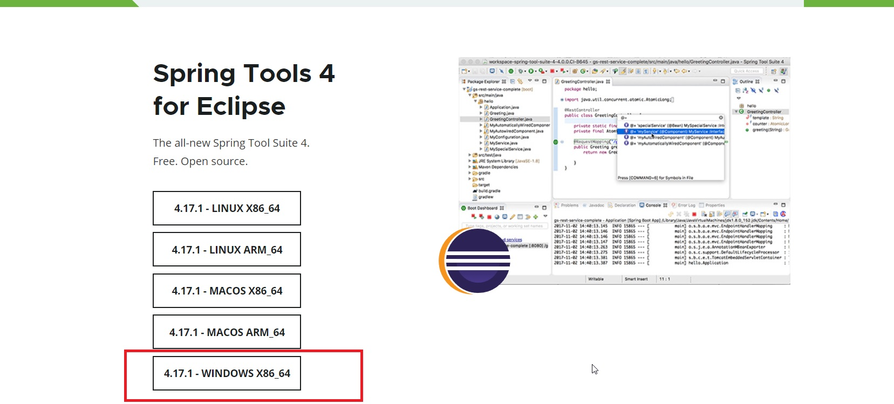
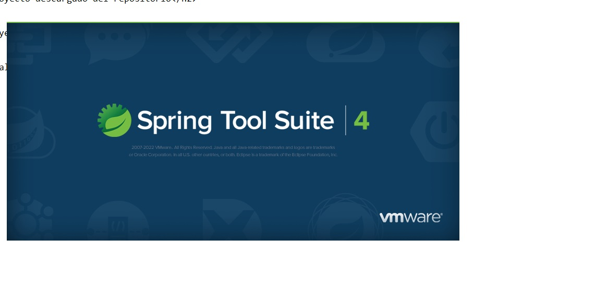
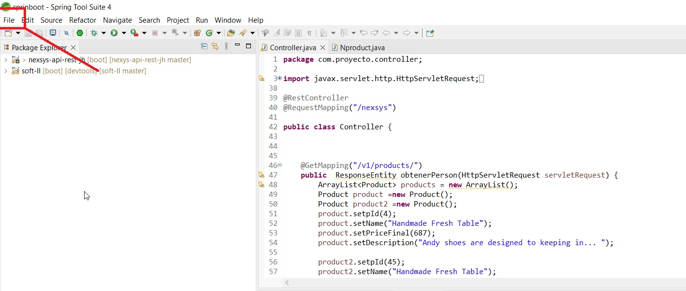
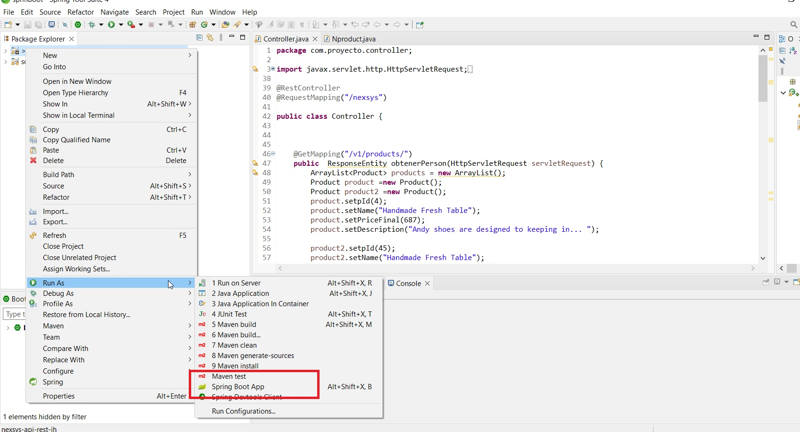
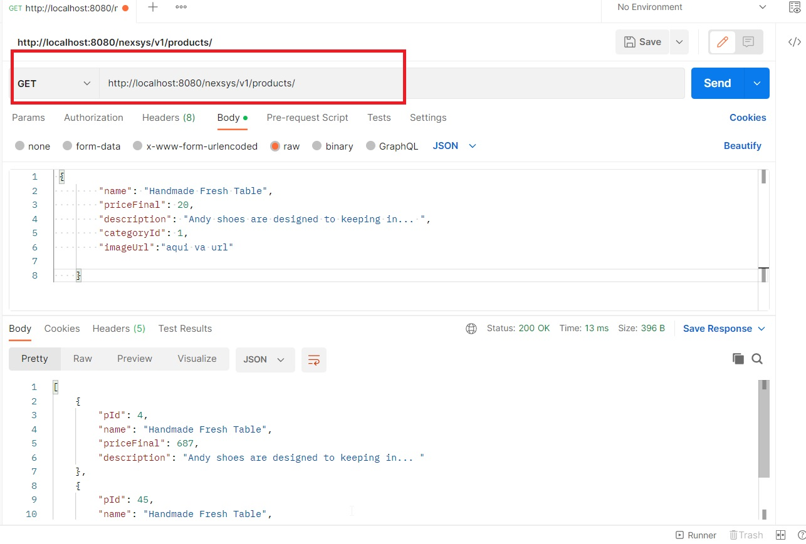
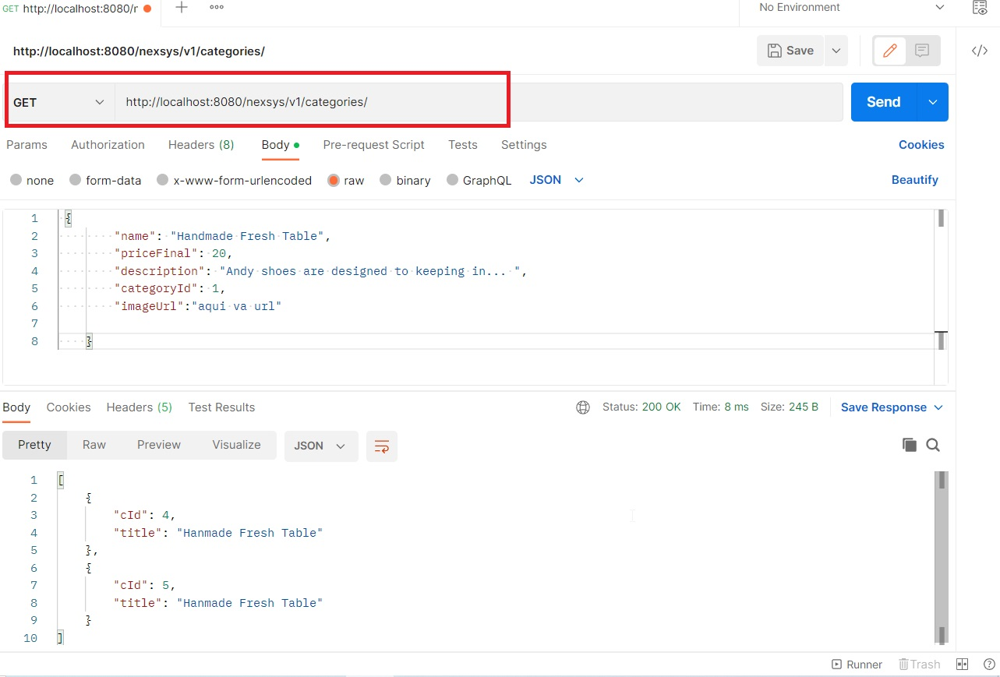
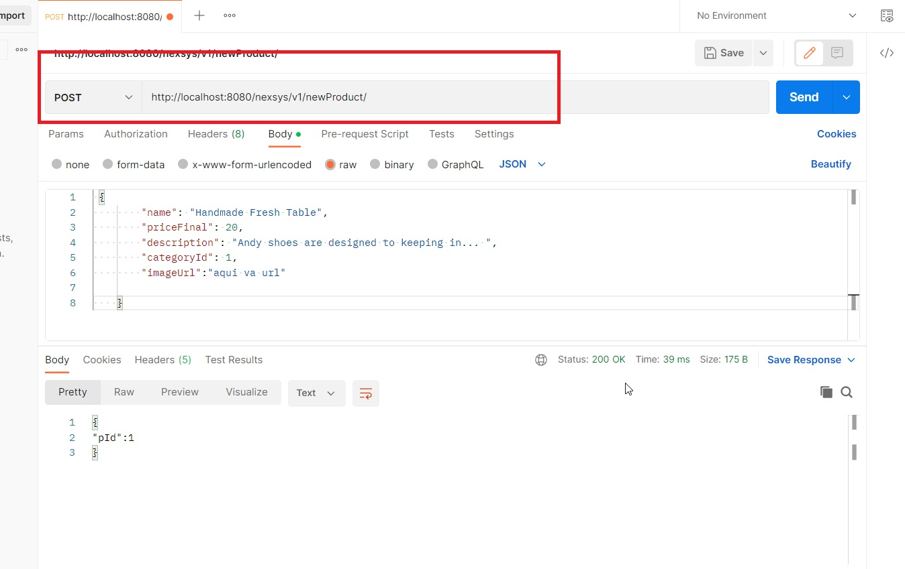

<h1 align="center">       Prueba tecnica Netxys </h1>

<h3 align="center">Nombre Julián David Hernández Torres  (Virtual Private Network)</h2>

<h3 align="center">instamos springboot para desplegar el api  ls-a</h2>

<h3 align="center">Paso 2  importamos el proyecto donde lo descargamos -/h2>

<h3 align="center"> Paso 3  ejecutamos  la apirest"</h2>

<h2 align="center">Conmenzamos hacer peticiones a la APIREST creada por medio de postman</h2>
<h3 align="center"> Path http://localhost:8080/nexsys/v1/products/"</h2>

<h3 align="center"> Path http://localhost:8080/nexsys/v1/categories/"</h2>

<h3 align="center"> Path http://localhost:8080/nexsys/v1/newProduct/"</h2>

